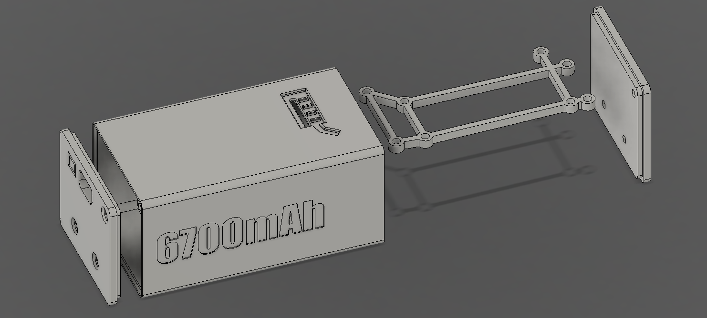
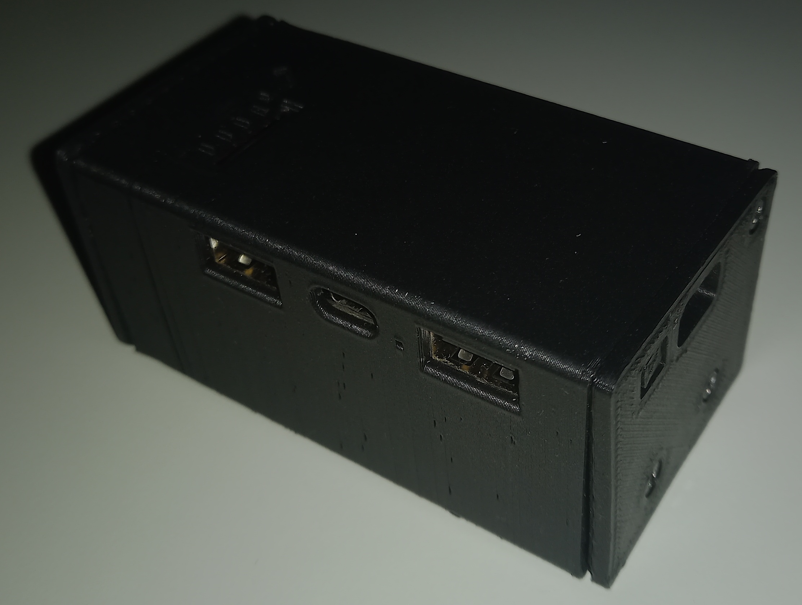

# Juicebox
Miniature IP5328P-based dual 18650 powerbank

Why buy a fire hazard when you can make one? 18650 cells are readily available and cheap (especially if you hate having insurance) and aliexpress is full of questionably designed driver boards. An ideal gadget for all DIYers and people who love to live on the edge.
Juicebox combines these two exhilarating ways of life into a handy miniature package the size of a small frag grenade

Project is also available on [Printables](https://www.printables.com/model/926291)

## Features

- injoinic IP5328P-based power board (65x32mm)
	- 2x USB Type A outputs
	- 1x USB Type C input/output
	- 1x USB micro-B input
	- 5/9/12v output
	- 5/9v input
	- Supports QC2/3, FCP, AFC, HTCPCP, USB-PD etc.
	- Supports PPS adjustable voltage
	- Battery level indicators (25/50/75/100%) (red LED)
	- Quick charge indicator (blue LED)
	- Full IC datasheet [here](http://www.injoinic.com/wwwroot/uploads/files/20200221/ec29931791194a51119ee1d6a4a21efb.pdf)
- 2x Detachable 18650 cells in cradle for easy replacement
- Fire extinguisher not included (optional)

## 3D Parts

This project consists of 4 printable components, available within the design f3d/step files, as well as STLs in [/Output/STL](/Output/STL):
- Midplate: 3mm thick plate used for attaching the controller board to the battery holder
- Case_Shell: Outer housing for the powerbank, print upright (hole across the Z-axis) with supports
- Case_cover_L: left cap (looking at the port side) for screwing into the enclosure and battery holder, print it with the outer part facing up and use supports for the lip.
- Case_cover_R: Right cap incorporating a passthrough for the power button and a microUSB port hole, print like the left

#### Additional parts required:

- IP5328P charging board. Similar to [this](https://www.aliexpress.com/item/4000574214602.html) or just use it as a search term on AliExpress/Amazon.
- 1x dual 18650 cell battery holder. I used [this](https://grobotronics.com/battery-holder-2x18650-for-pcb.html) from a Greek shop and I don't know how common it is but dimensions are 80x42mm with a 19x55mm screw pattern for the bottom and 19mm apart side screws
- 2x 18650 rechargeable battery cells. Make sure they're from a reputable brand and source such as Samsung or Panasonic and preferably not from AliExpress or whatever (Genuine Panasonic NCR18650B 3350mAh cells like the ones I used should be around 7$ each)
- 8x M2.5x3 Philips thin-capped screws for the mounting midplate
- 6x M2.5x4 Philips thin-capped screws for the sides

## Assembly

- Print all parts in reasonable orientations, specified above where needed
- Solder both positive battery holder terminals to the B+ pad on the board and both negative terminals to B- using as short wire as possible. You may also need to cut the tabs short, especially on the negative side where the edge of the board meets the case
- Screw the midplate to the board using 4 M2.5x3 screws coming from the board side
- Screw the battery holder using another 4 M2.5x3 screws
- Screw the right cap (with the microusb board to the battery holder using two screws
- Slot the assembly through the shell, then screw the third screw of the cover
- Screw the left cap using three screws, completing the assembly
- Once the powerbank lights up or every time you replace the battery cells, you will/may need to recalibrate the charge controller
	- Charge the powerbank fully by plugging it in and **leave it plugged in for another 2 hours** after the indicators show full charge
	- Discharge the powerbank until it shuts off **fully** using a load (phone or other)
	- Charge the powerbank back up to full again
- Complete device should look a little something like this: 

## License
This design is licensed under the WTFPL because if you light your backpack on fire I want nothing to do with it. That being said I've been using this for a while now and it hasn't exploded yet so it should be fine. I even got it through airport security without any issues!

Enjoy :)
